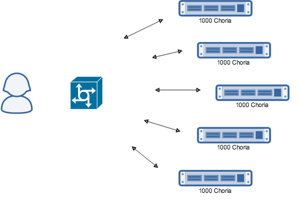

# Flat Network with Single Broker

This is the most basic flat network, a single NATS broker with 1000s of Choria instances connected to it.

Use this to determine the top scale a certain spec NATS broker will handle unclustered, this is a good setup for a single Federation Member network, though you might want to test HA too.



## Setup

### NATS

You need `gnatsd` running on one of the NATS servers where all the nodes can connect to, a simple TLS free `gnatsd` can be started with:

```
# ulimit -n 900000
# gnatsd -T -m 8222 -p 4222
```

NOTE the `ulimit` above should be set to enough, NATS in it's current version will not log about out of file handles except in debug, so set to very high.

Lets say for example this is running on `192.168.1.1:4222`

### Choria Instances

We'll run 100 instances per node, 10 agents and 5 sub collectives:

```
$ mco playbook run start-emulator.yaml --agents 10 --collectives 5 --instances 100 --servers 192.168.1.1:4222
```

After your tests you can stop it using:

```
$ mco playbook run stop-emulator.yaml
```

### Client Config

You'll need a special client cfg to connect to this network, save it in `emulator-client.cfg`:

```
plugin.choria.middleware_hosts = 192.168.1.1:4222

# for very large networks you'll need to do some tweaks here
discovery_timeout = 5

collectives = mcollective
connection_timeout = 3
connector = nats
identity = emulator_client
libdir = /opt/puppetlabs/mcollective/plugins
logger_type = console
loglevel = warn
main_collective = mcollective
securityprovider = choria
plugin.choria.security.serializer = json
plugin.choria.use_srv_records = false
```

Run the scenario using `measure-collective.rb --config emulator-client.cfg` with additional options for amount of tests etc, you should see something like this:

```
$ ./measure-collective.rb --config emulator-client.cfg  --description "50 000 nodes, single NATS, BR" --disable-tls --count 100
Performing 100 tests against 50264 nodes with a payload of 10 bytes stats in reports/20170922-101621
 1506075420: REQUEST #: 1    OK: 50264 / 50264 BLOCK TIME: 18.334 ELAPSED TIME: 18.418 ✓
 1506075440: REQUEST #: 2    OK: 50264 / 50264 BLOCK TIME: 19.694 ELAPSED TIME: 19.762 ✓
 1506075458: REQUEST #: 3    OK: 50264 / 50264 BLOCK TIME: 18.394 ELAPSED TIME: 18.478 ✓
....
 1506077296: REQUEST #: 98   OK: 50264 / 50264 BLOCK TIME: 18.354 ELAPSED TIME: 18.422 ✓
 1506077315: REQUEST #: 99   OK: 50264 / 50264 BLOCK TIME: 18.607 ELAPSED TIME: 18.709 ✓
 1506077334: REQUEST #: 100  OK: 50264 / 50264 BLOCK TIME: 18.792 ELAPSED TIME: 18.858 ✓

OK: 100 FAILED: 0 MIN: 18.1404 MAX: 20.4510 AVG: 19.1394 STDDEV: 0.6294
```

The tick marks at the end tells you the amount of replies matched the requests etc.
